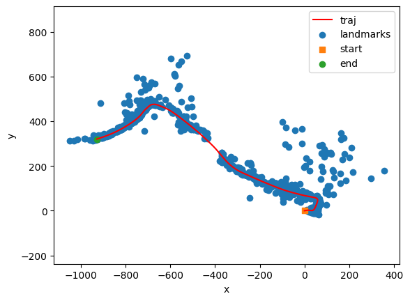
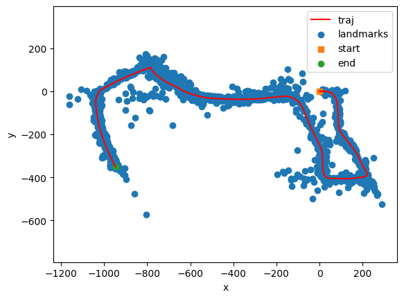

# VisualIntertialSLAM
# About
This project implemented a Bayes Filter to solve the Simultaneous Localization and Mapping(SLAM) problem on a robot moving in an initially unknown environment. Specifically we implemented a Visual Inertial Extended Kalman Filter that uses a gaussian  distribution estimate the robot pose and landmark positions at any given time. The map consists of the collection of these landmark feature points.  

## Environment Setup
* To replicate the project, first build a conda environment using the provided ece276a.yaml file as follows : 
<pre> $conda env create -f ece276a.yaml</pre>
* Finally activate the conda environment 
<pre> $conda activate ece276a </pre>

## File Details
Files are structered in the code folder. 
<pre>
code
├── data
│   ├── 03.npz
│   └── 10.npz
├── ece276a.yaml
├── pr3_utils.py
├── README.md
├── requirements.txt
├── visual_slam.py
└── vslam.py
</pre>

### a. vslam.py 
This script is used to just run the IMU EKF predict step and the landmark update step corresponding to Problems (a) and (b) in the Project Guidelines pdf. 
Usage :-
<pre> $python3 code/vslam.py </pre>

### b. visual_slam.py
This script aims to run the full Visual Inertial SLAM algorithm on the given datasets by running the update step for both the IMU pose and the landmarks at once. 
Usage :- 
<pre> $python3 code/visual_slam.py </pre>

## Technical Report
* [Sambaran Ghosal. "Visual Inertial SLAM" March 2022](report/Visual_Inertial_SLAM.pdf)

## Results

### Independent IMU predict and Landmark Updates 
### Data 03.npz 

   

### Data 10.npz

   

### Visual SLAM 
### Data 03.npz

   

### Data 10.npz

   

